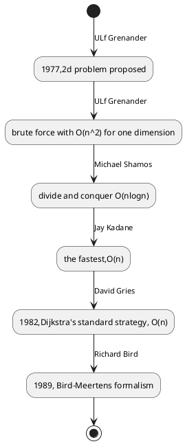

# Maximum sum subarray problem

Notes about the maximum sum subarray problem

## History

## Reference

1. [wikipedia](https://en.wikipedia.org/wiki/Maximum_subarray_problem)
2. [different methods](https://cs.slu.edu/~goldwamh/courses/slu/csci314/2012_Fall/lectures/maxsubarray/)
